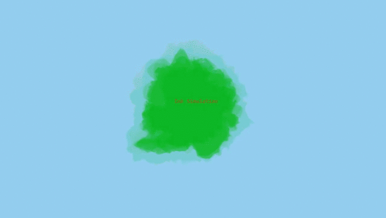

# Pixi-JS-Ink-Simulation

Create a class that sets up vertices.  
Declare 5 functions: fracture, morph, travel, draw, drawLayer.  
<ul>
  <li>fracture: 2 parameters (layer, amt) - </li>
  <li>morph: 1 parameter (layerIndex) - </li>
  <li>travel: No parameters - </li>
  <li>draw: No parameters - </li>
  <li>drawLayer: 2 parameters (points, a) - </li>
</ul>

Updated: May 1, 2021

